I really like teaching and doing educational outreach, especially k-12. I have experience 
with engineering labs, curriculum design, and FIRST Robotics.
If you want help with an outreach project let me know!\\
\\
Outside of the lab I am *really* into coffee. I currently have 9 manual
brewing systems, and my newest endeavor is perfecting my brewing water
by creating the right balance of magnesium, calcium, and carbonate ions (i.e. 
adding salt and baking soda to distilled water).\\
\\
I also really enjoy the outdoors. I just completed a 3 day, 49 mile rim-to-rim-to-rim
backpacking trip at the Grand Canyon with my dad.

	

		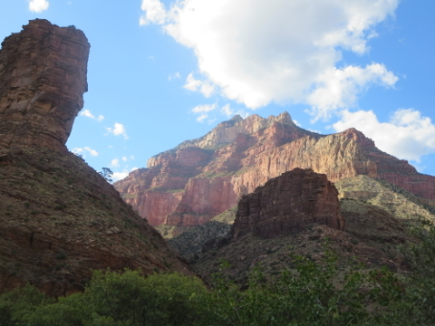
	

	

		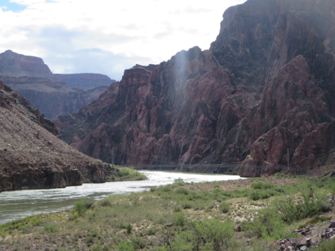
	

	

		
	

	

		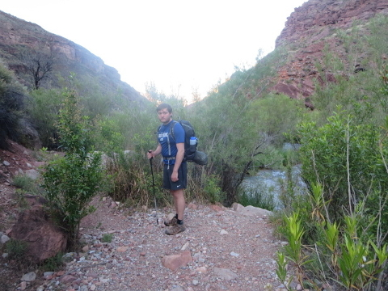
	

	

		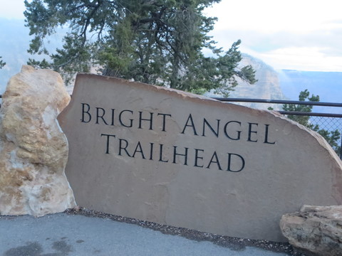
	

	

		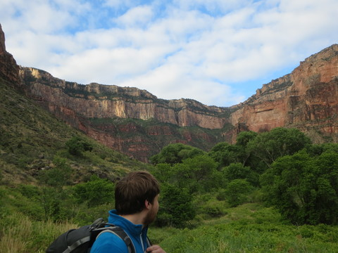
	

	

		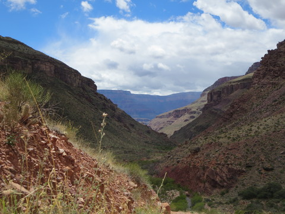
	

	

		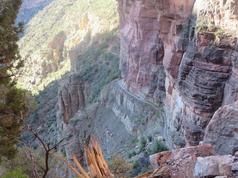
	

	

		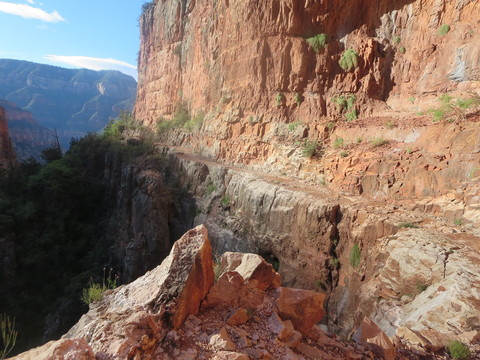
	

	

		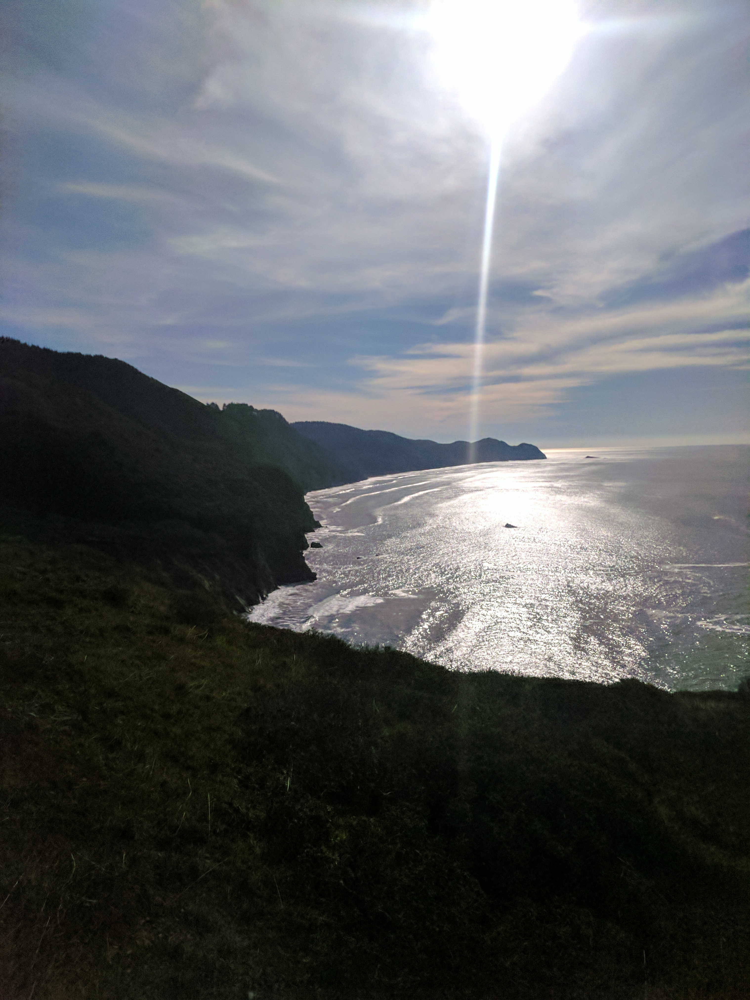
	

	

		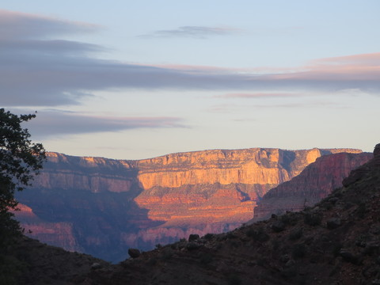
	

	

		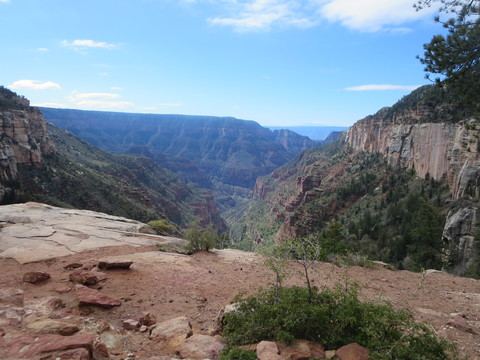
	

	

		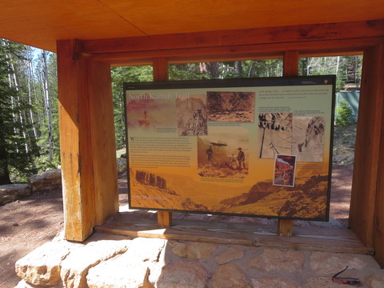
	

	

		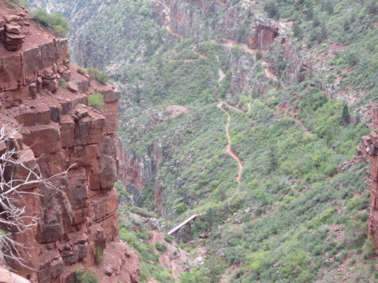
	

